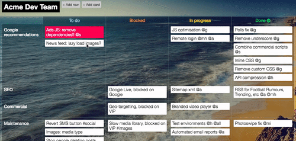

# Zenboard: team work made easy



Try the demo here http://zenbrd.herokuapp.com/

## Create your own board in 10 minutes

Zenboard is lightweight - suitable for hosting on a free Heroku account.
(If you want to host elsewhere try [this guide](#hosting-elsewhere)).

1. You will need Git installed locally
https://git-scm.com/downloads

2. Clone the Zenboard repo
```
git clone https://github.com/matthumphreys/zenboard.git
cd zenboard
```

3. (Signup for a Heroku account)[https://signup.heroku.com/]

4. (Install the Heroku CLI)[https://devcenter.heroku.com/articles/heroku-cli]

5. Make sure you've logged in to Heroku CLI and created the app
```
heroku login
heroku create
```

6. Provision JawsDB (MySQL): `heroku addons:create jawsdb`

7. Deploy Zenboard to Heroku: `git push heroku master`

8. Launch Zenboard in a browser: `heroku open`

Enjoy!

More info on using Node.js on Heroku (here)[https://devcenter.heroku.com/articles/getting-started-with-nodejs#deploy-the-app]

### Hosting elsewhere

All you need to host Zenboard is MySQL and a server supporting Node.js.

In most cases:
- there will be relatively few requests per minute so minimal server resources will be needed
- high availability / clustering / load balancing isn't needed


## Contribute

Want to get involved? Get in touch!
